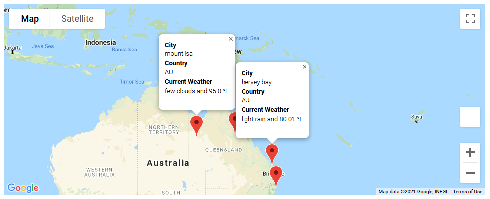

# World_Weather_Analysis

## Project Overview

This project had 3 major deliverables:

1. Retrieve Weather Data using http://api.openweathermap.org
2. Create a Customer Travel Destinations Map using Google Maps API
3. Create a Travel Itinerary Map using Google Maps API

## Results

## 1. Retrieve Weather Data using openweathermap

#### a. Create a random set of Latitude & Longitude pairs

#### b. Use citipy to find nearest city to each Lat & Lon

#### c. Populate DataFrame with OpenWeatherMap data for each city

#### d. Ouput DataFrame as WeatherPy_Database.csv

final_city_data_df DataFrame in Weather_Database (with Weather Description column)

## 2. Create a Customer Travel Destinations Map

#### a. Read WeatherPy_Database.csv into city_data_df DataFrame

#### b. Get User min & max temperature preferences

#### c. Filter city_data_df for user prefs & remove NaN's

#### d. Create hotel_df with hotels nearest to each city center

#### e. Drop any rows for which hotel could not be found

#### f. Save resulting DataFrame as WeatherPy_vacation.csv

final_hotel_df DataFrame Vacation_Search (with Weather Description column)

#### g. Create map with markers

WeatherPy_vacation_map

## 3. Create a Travel Itinerary Map

#### a. Read WeatherPy_vacation.csv

#### b. Create map with markers (same as 2g above)

#### c. Select 4 cities (close together, in same country) as an itinerary

#### d. Create map with directions_layer for our itinerary

WeatherPy_travel_map

#### e. Create another map with a marker_layer for our four cities

WeatherPy_travel_map_markers

## Summary

This project was a lot of work. It helped us learn how to use Python & Pandas to interact with the OpenWeatherMap and Google Maps API.

In addition, this week we also used the OpenWeatherMap API, Google Maps API, Pandas, and MatplotLib to create scatter plots with linear regression fits plotted on them to show trends for global temperature, humidity, and wind speed for the Northern and Southern Hemisphere.

City Latitude vs. Max Temperature 04/09/21

Linear Regression on the Northern Hemisphere for Maximum temperature

